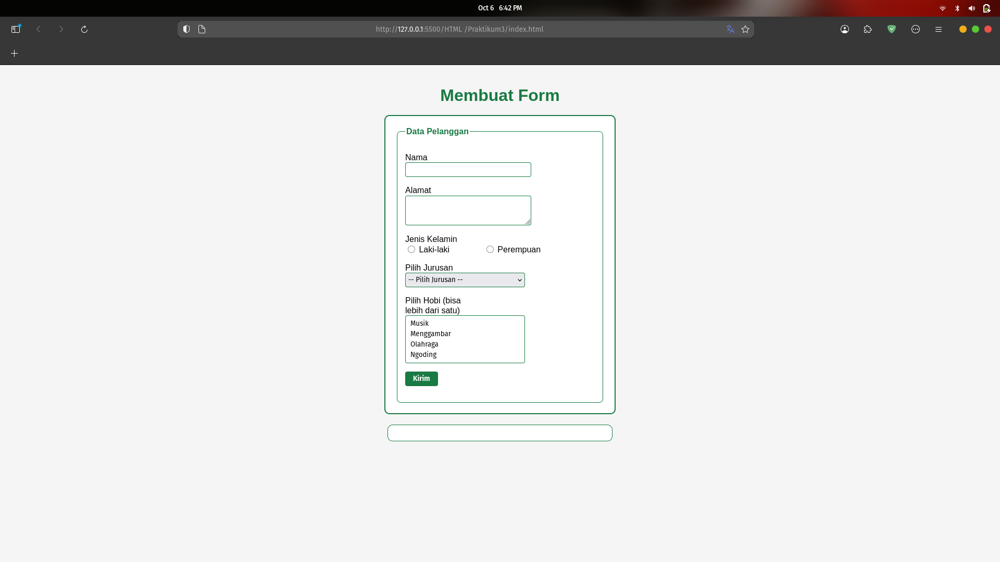

# LAB 03 Web
```
Nama : Danur Wenda Prasetiyo 
Kelas : TI.24.A1
NIM : 312410008
```
# Membuat Form
## Kode Html
```html
<!DOCTYPE html>
<html lang="id">
<head>
    <meta charset="UTF-8">
    <meta name="viewport" content="width=device-width, initial-scale=1.0">
    <title>Form Dropdown & Listbox</title>
    <link rel="stylesheet" href="style.css">
</head>
<body>
    <header>
        <h1>Membuat Form</h1>
    </header>

    <form id="formData">
        <fieldset>
            <legend>Data Pelanggan</legend>

            <p>
                <label for="nama">Nama</label>
                <input type="text" id="nama" name="nama" required>
            </p>

            <p>
                <label for="alamat">Alamat</label>
                <textarea id="alamat" name="alamat" cols="20" rows="3"></textarea>
            </p>

            <p>
                <label>Jenis Kelamin</label><br>
                <input type="radio" id="jk_l" name="kelamin" value="Laki-laki">
                <label for="jk_l">Laki-laki</label>
                <input type="radio" id="jk_p" name="kelamin" value="Perempuan">
                <label for="jk_p">Perempuan</label>
            </p>

            <p>
                <label for="jurusan">Pilih Jurusan</label><br>
                <select id="jurusan" name="jurusan">
                    <option value="">-- Pilih Jurusan --</option>
                    <option value="Teknik Informatika">Teknik Informatika</option>
                    <option value="Sistem Informasi">Sistem Informasi</option>
                    <option value="Teknik Industri">Teknik Industri</option>
                </select>
            </p>

            <p>
                <label for="hobi">Pilih Hobi (bisa lebih dari satu)</label><br>
                <select id="hobi" name="hobi" multiple size="4">
                    <option value="Musik">Musik</option>
                    <option value="Menggambar">Menggambar</option>
                    <option value="Olahraga">Olahraga</option>
                    <option value="Ngoding">Ngoding</option>
                </select>
            </p>

            <p><input type="submit" value="Kirim"></p>
        </fieldset>
    </form>

    <div id="hasil"></div>

    <script>
        document.getElementById('formData').addEventListener('submit', e => {
            e.preventDefault();
            const nama = document.getElementById('nama').value;
            const alamat = document.getElementById('alamat').value;
            const kelamin = document.querySelector('input[name="kelamin"]:checked')?.value || '-';
            const jurusan = document.getElementById('jurusan').value;
            const hobi = Array.from(document.getElementById('hobi').selectedOptions).map(o => o.value);

            document.getElementById('hasil').innerHTML = `
                <fieldset>
                    <legend>Data yang Dikirim</legend>
                    <p><b>Nama:</b> ${nama}</p>
                    <p><b>Alamat:</b> ${alamat}</p>
                    <p><b>Jenis Kelamin:</b> ${kelamin}</p>
                    <p><b>Jurusan:</b> ${jurusan || '-'}</p>
                    <p><b>Hobi:</b> ${hobi.length ? hobi.join(', ') : '-'}</p>
                </fieldset>
            `;
        });
    </script>
</body>
</html>
```

## Kode Style CSS
```css
body {
    font-family: Arial, sans-serif;
    margin: 40px;
    background-color: #f5f5f5;
}

header h1 {
    color: #197a43;
    text-align: center;
    margin-bottom: 20px;
}

form {
    width: 400px;
    margin: 0 auto;
    background: #fff;
    border: 2px solid #197a43;
    border-radius: 10px;
    padding: 20px;
}

fieldset {
    border: 1px solid #197a43;
    border-radius: 8px;
    padding: 15px;
}

legend {
    font-weight: bold;
    color: #197a43;
}

label {
    display: inline-block;
    width: 120px;
}

input[type="text"],
textarea,
select {
    border: 1px solid #197a43;
    border-radius: 4px;
    padding: 5px;
    width: 230px;
}

input[type="submit"] {
    border: none;
    background-color: #197a43;
    color: #fff;
    font-weight: bold;
    padding: 6px 15px;
    border-radius: 4px;
    cursor: pointer;
}

input[type="submit"]:hover {
    background-color: #145e33;
}

#hasil {
    width: 400px;
    margin: 20px auto;
    background: #fff;
    border: 1px solid #197a43;
    border-radius: 10px;
    padding: 15px;
}
```
## Hasil ScreenShot

